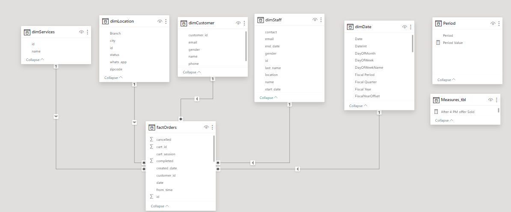
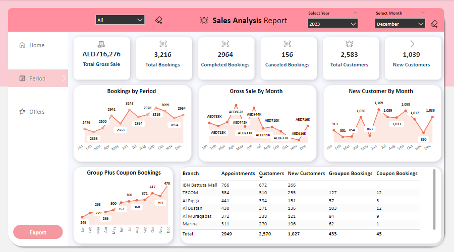
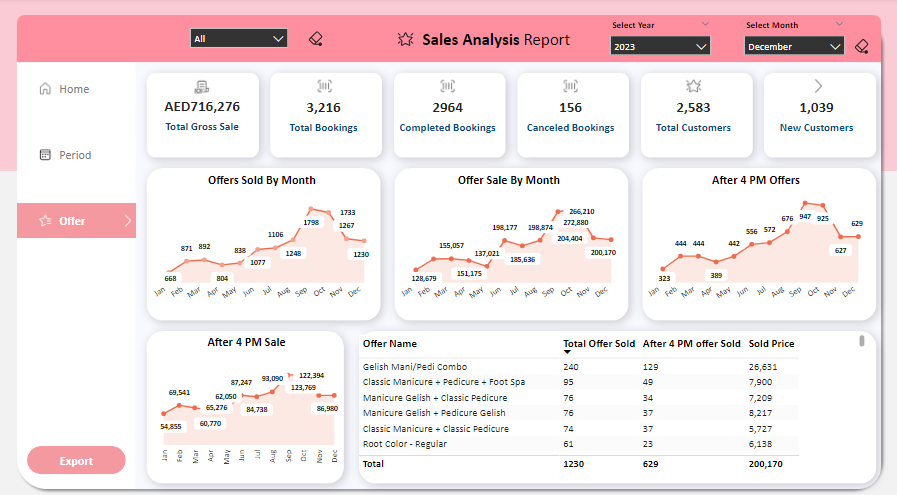

# Mirrors Beauty Salons Sales Analysis Dashboard

---

## Introduction
In response to a concerning trend of declining sales performance within our beauty salon Branches over the past three months, a strategic initiative has been launched to revitalize and boost sales. This project aims to leverage comprehensive data analysis to gain insights into customer behavior, sales trends, and the efficacy of marketing initiatives within our beauty salon branches.
The core objectives encompass a detailed examination of sales data spanning the past two years. This includes a meticulous breakdown of total and new customer acquisitions per branch, facilitating a thorough evaluation of marketing strategies' impact on customer acquisition.
Key Performance Indicators (KPIs) about customer and sales analysis will be meticulously examined, including but not limited to:
- Total and new client acquisition per branch.
- Evaluation of sales and customer metrics derived from promotional offers.
- Comparative analysis of historical sales against current performance.
- Identification of patterns in customer behavior influencing sales fluctuations.
The ultimate goal is to unveil actionable insights that can steer targeted marketing efforts, optimize customer engagement strategies, and drive substantial improvements in sales performance across our beauty salon branches.

## Problem Statement 
- **Customer Acquisition Analysis:**
  - Differentiate between total clients and new clients acquired in each salon branch over the past two years.
  - Identify trends and patterns in customer acquisition to understand growth or decline across branches.
  - Analyze the source of new customers (e.g., referrals, marketing campaigns, walk-ins) to gauge the effectiveness of various acquisition channels.
- **Sales Performance Evaluation:**
  - Compare sales figures from the past two years across branches and discern any notable fluctuations or consistent trends.
  - Break down sales by service or product categories to identify high-performing and underperforming areas.
  - Assess the impact of seasonal variations or external factors on sales to strategize for fluctuations.
- **Effectiveness of Marketing Efforts:**
  - Analyze the correlation between marketing campaigns/offers and sales figures to determine their impact on customer engagement.
  - Evaluate the success rates of different promotional offers in attracting new customers and driving sales.
  - Measure customer response and conversion rates concerning marketing initiatives to refine future strategies.
- **Customer Retention and Loyalty:**
  - Examine the rate of repeat customers and their contribution to overall sales in each branch.
  - Identify factors influencing customer retention and loyalty, such as service quality or personalized experiences.
  - Develop strategies to enhance customer loyalty and encourage repeat visits through targeted promotions or loyalty programs.
- **ROI Assessment of Offers and Campaigns:**
  - Calculate the return on investment (ROI) for various marketing campaigns and promotional offers.
  - Determine the cost-effectiveness of each initiative concerning customer acquisition and sales generation.
  - Optimize marketing spend by focusing on high-ROI strategies and adjusting or discontinuing low-performing ones.
- **Geographical and Demographic Analysis:**
  - Conduct geographical analysis to identify potential market gaps or opportunities in specific locations.
  - Analyze demographic data to tailor marketing strategies to the preferences and behaviors of different customer segments.
  - Customize offerings or services based on regional or demographic insights to maximize engagement.

## Tools Leveraged
- **Power BI:** Employed for dynamic data visualization, interactive dashboard creation, and comprehensive report generation.
- **DAX (Data Analysis Expressions):** Utilized for complex calculations and measures within Power BI for in-depth data analysis.
- **Data Modeling:** Implemented robust data models in Power BI to ensure data integrity and facilitate efficient analysis.
- **Power Query:** Used for data transformation and cleaning to prepare high-quality data inputs for analysis in Power BI.
- **MySQL:** Leveraged for data extraction, management, and integration, supporting seamless handling of diverse datasets.

## Modeling
- **Data Extraction from MySQL:**
  - Connected Power BI to our company's MySQL website, extracting crucial data on customers, sales, and marketing campaigns.
- **Initial Data Review and Modeling:**
  - Analyzed the extracted tables to understand relationships and data structures.
  - Identified primary keys and relationships between tables.
- **Star Schema Development:**
  - Created a star schema model with a central fact table for sales transactions.
  - Segregated related dimensions (e.g., customers, products, time) into individual tables.
  - Established robust relationships between the central fact table and dimensions.
- **Transformations for Star Schema:**
  - Utilized Power Query to transform the data, structuring it according to the star schema model.
  - Ensured each dimension table contained unique attributes and aligned with the schema.
- **Model Implementation and Validation:**
  - Loaded the transformed data into Power BI, maintaining established relationships.
  - Validated the model for data consistency, integrity, and accuracy.
  - Conducted test visualizations and queries to confirm the efficacy of the star schema model.
**Result:**
Our approach involved transforming raw data from MySQL into a structured star schema within Power BI, enhancing the efficiency of data analysis and visualization for better decision-making.
---

This streamlined model optimized data querying and reporting, facilitating actionable insights crucial for strategic business decisions.

## Visualizations
**Customer Period Analysis Page Summary:**

- **Page Overview:**
  - The Customer Period Analysis dashboard is designed to offer a comprehensive view of customer-related metrics and sales performance over time.
- **Top Slicer Filters:**
  - Utilizes two slicers positioned at the top of the page, allowing users to dynamically filter data by year and month for targeted analysis.
- **Key Metrics Displayed via Card Visuals:**
  - Presents essential metrics in card visuals, including Total Gross Sales, Total Bookings, Completed Bookings, Canceled Bookings, Total Customer Count, and New Customer Count.
- **Insightful Charts:**
  - Provides insightful charts illustrating trends and patterns:
    - Bookings by Month: Bar chart showcasing the distribution of bookings across different months.
    - Gross Sale by Month: Line chart displaying the trend of gross sales over the selected period.
    - New Customer by Month: Area chart visualizing the acquisition of new customers per month.
    - Group and Cobone Sale by Month: Stacked column chart highlighting sales distribution between group and Cobone offers.
- **Tabular Representation:**
  - Includes a table visual to present detailed data or a breakdown of information related to bookings, sales, or customer metrics in a tabular format.
**Result:**
The Customer Period Analysis page offers a dynamic and comprehensive view of crucial customer-related KPIs and sales performance metrics over specific timeframes. Users can interactively explore and derive actionable insights by filtering data based on year and month criteria.
---

---
This visual representation empowers decision-makers to identify trends, assess performance, and make data-driven strategies to enhance customer engagement and sales.

**Offers Performance Dashboard Summary:**

- **Page Overview:**
  - The Offers page provides a detailed analysis of the performance of different promotional offers, aiding in understanding their impact on sales and customer engagement.
- **Top Slicer Filters:**
  - Employs slicers at the top of the page, allowing users to dynamically filter data based on specific criteria such as offer type, duration, or other relevant parameters.
- **Key Metrics via Card Visuals:**
  - Showcases essential metrics using card visuals, including Total Offered, Accepted Offers, Completed Sales, Revenue from Offers, and Conversion Rates.
- **Insightful Charts:**
  - Presents key insights through various charts:
    - Offer Performance by Type: Stacked column chart highlighting performance comparison between different offer types.
    - Sales Conversion Rates: Line chart displaying conversion rates over time for the selected offers.
    - Revenue from Offers: Bar chart illustrating revenue generated from different offers.
- **Tabular Representation:**
  - Includes a table visual presenting detailed data or a breakdown of information related to offering performance metrics in a tabular format for deeper analysis.
  ---
  
  ---
  This visual depiction enables stakeholders to assess offer performance trends, identify successful strategies, and refine marketing initiatives for better sales outcomes.

  ## Conclusion
  The comprehensive analysis conducted on sales performance, customer engagement, and offer effectiveness has unearthed valuable insights into our beauty salon branches' operations. This deep dive into historical data has highlighted trends, strengths, and areas for improvement crucial for strategic decision-making.
**Key Findings:**
- Clear patterns in customer acquisition and retention across branches.
- Identification of high-performing and underperforming services or products.
- Correlation between specific marketing offers and sales impact.
- Seasonal variations impacting sales and customer behavior.
**Recommendations:**
- Targeted Marketing Strategies:
  - Focus on successful marketing offers to maximize customer engagement.
  - Tailor promotions based on seasonal trends and customer preferences.
- Service Optimization:
  - Enhance underperforming services/products based on customer demand.
  - Prioritize high-demand services to capitalize on market trends.
- Customer Retention Initiatives:
  - Implement loyalty programs to foster repeat visits and customer loyalty.
  - Improve service quality to enhance overall customer satisfaction.
- Data-Driven Decision-Making:
  - Continuously monitor and analyze sales data to adapt strategies dynamically.
  - Invest in ongoing data analysis to stay agile and responsive to market changes.
**Conclusion Impact:**
The actionable recommendations derived from this analysis aim to bolster sales performance, optimize customer engagement, and solidify our position in the competitive beauty industry landscape.
---
This succinct conclusion and set of recommendations summarize the project's findings and offer actionable insights crucial for driving growth and enhancing the overall performance of the beauty salon branches.

